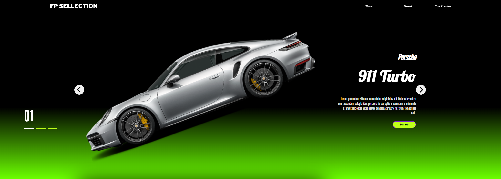

<h1>Site de Carros</h1>
 

<h2> <a href="https://alissonclaro.github.io/project-carsiteJs/" target="_blank"> Car Site </a>  <---- Link.</h2>  

 
 
<h2>Projeto feito em aula referente a <a href="https://aulas.devclub.com.br">DevClub</a></h2>
 
<h2>Imagens do projeto</h2>

 
.
